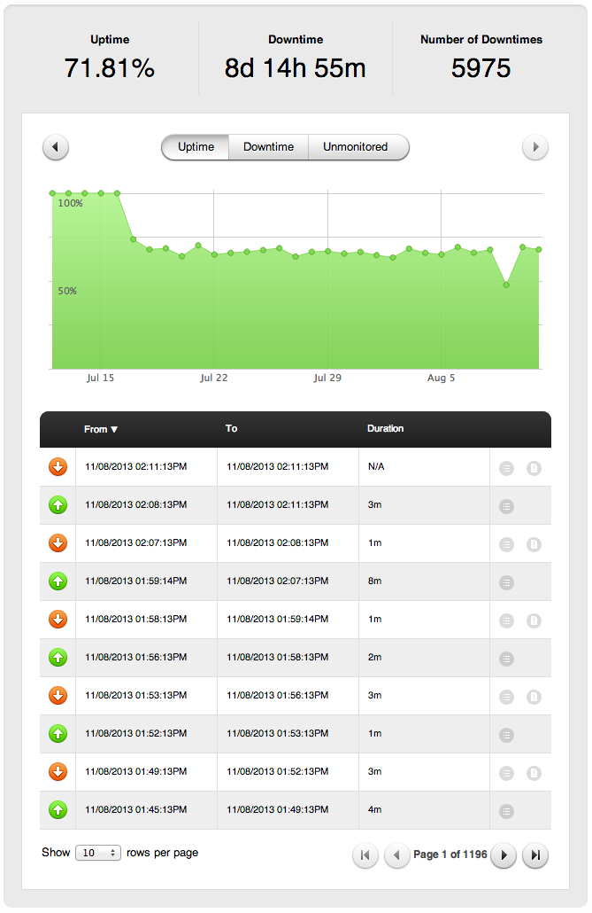

I recently launched my fifth app on [Pagoda Box](http://pagodabox.com/), and although I love the concept and the workflow it just isn’t ready for primetime. The service is far too unreliable for a mission-critical application; my apps are routinely plagued by bouts of downtime, the worse being this past week when my apps were down for upwards of 6 hours due to a [shared writable storage interruption](http://blog.pagodabox.com/shared-writable-storage-interruption/).

Here is a [Pingdom](http://pingdom.com/) report for one of my apps over the last 30 days:

I’ll be honest in saying that I have had months with 99% uptime. However, there should never be a month that looks as bad as this.

Furthermore, Pagoda Box support is only available 8am-5pm Monday-Friday. This alone is likely a deal breaker for any mission-critical app.

I hope that Pagoda Box continues to expand it’s offerings as a company, as I see HUGE potential in the platform. The service and workflow is amazing, the user interface is friendly, and it makes administering a cloud infrastructure dead simple. However, the reliability is what is killing it for me. If they can improve the reliability of the platform and provide 24/7 support Pagoda Box could become a premier application hosting provider for PHP, but for now I will stick to hosting my apps on [Media Temple](http://mediatemple.net/).
