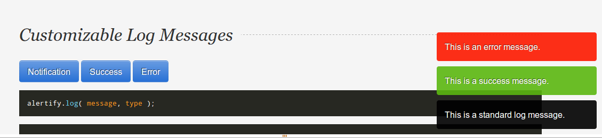

Here is an extremely simple and elegant way to send Growl-like notifications to your users. It requires the [Notifications](https://github.com/edvinaskrucas/notification) package for Laravel 4, as well as the [Alertify](https://github.com/fabien-d/alertify.js) jQuery plugin.



## Notifications in Laravel

With the Notification package [installed](https://github.com/edvinaskrucas/notification#installation), it’s time to get to work sending notifications to our users. The Notification package makes this dead simple. Here is a couple examples:

```php
// Success message
Notification::success('User successfully saved!');

// Error message
Notification::error('You do not have permission to delete that record');

// Info message
Notification::info('This is a nice piece of information');
```

Creating notifications in your controller requires one line of code:

```php
// Example usage in controller action
public function postUser()
{
    $validation = Validator::make(Input::all(), [
        // rules
    ]);

    if ($validation->passes()) {
        $user = new User;
        // set attributes
        $user->save();

        // Create notification!
        Notification::success('User saved successfully!');

        return Redirect::back();
    }
}
```

## Displaying Errors with Alertify

Displaying our alerts is also dead simple. Create a partial view and include it in your master layout, or include the following code directly in your layout:

```html
<script type="text/javascript">
  {{ Notification::showError('
  	alertify.error(":message");
  ') }}

  {{ Notification::showInfo('
  	alertify.log(":message");
  ') }}

  {{ Notification::showSuccess('
  	alertify.success(":message");
  ') }}
</script>
```

## Wrap Up

This is a simplified version, but it will give you some great functionality to build off of. For instance, the Notification package offers a warning notification, which I’ve left out as warning notifications are not implemented in the Alertify plugin. The notification package also allows you to create ‘instant notifications’ which are shown in the same request (i.e. don’t require a redirect), but using these requires using a different method, such as:

```php
Notification::successInstant('Instant success message');
```

I hope you’ve enjoyed this post and if you have a creative way of sending notifications please share it in the comments!
